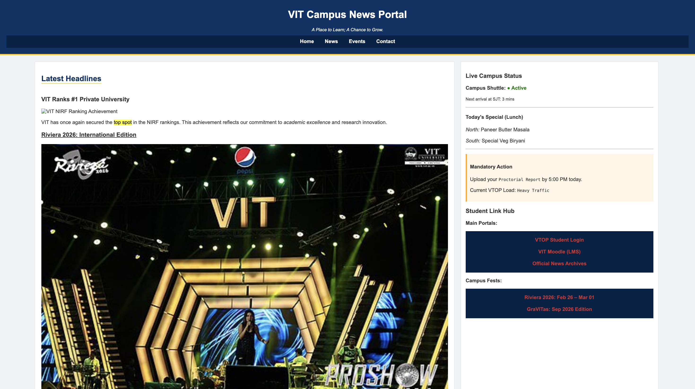

# VIT Campus News Portal

**Live Demo**  
https://ananyagpt1105.github.io/vit-campus-news-portal/

## Preview

## About the Project
This project is a campus news portal webpage designed for VIT University. The page displays campus news, event updates, student resources, and contact information in a structured layout using HTML and CSS.

## Features
- Campus news articles with images
- Sidebar with campus updates and links
- Upcoming events section
- Contact information section
- Navigation menu for quick access

## Technologies Used
- HTML
- CSS

## Concepts Practiced
- Semantic HTML structure
- Navigation menus
- Flexbox layout
- External CSS styling
- Image and link integration
